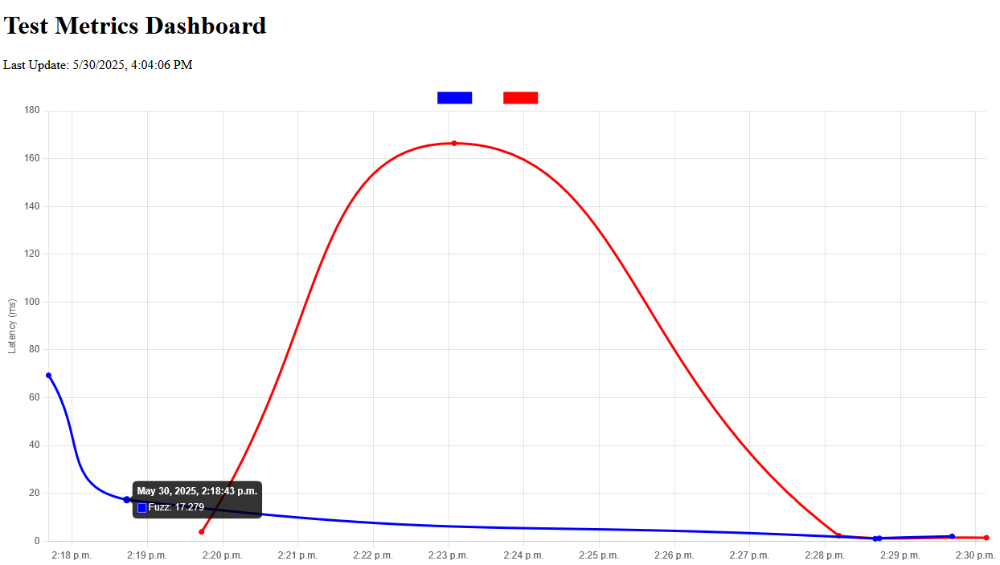

# Kiwi-Store

Deneysel ve hafifsiklet bir key-value store çalışmasıdır. Amaç geliştirmesi kolay, in-memory çalışan ve başlangıçta tek node üzerinden işleyen bir sistem kurmaktır. Çalışmada yer alan uygulamalar ve genel özellikleri şöyledir.

- Server Side _(kiwi-store-server)_
  - Sadece string türden key ve value çiftleri tutar
  - Key bilgisi 20, Value bilgisi 100 karakterden fazla olamaz
  - Key-Value bilgileri in-memory saklanır
  - Sunucu tarafı Tcp protokolü üzerinden çalışır
  - Tamamen asenkrondur
- CLI _(kiwi-store-client)_
  - Key, Value eklenmesi, çekilmesi, silinmesi gibi temel işlevleri sağlayan terminal uygulamasıdır
- Tester _(kiwi-store-loadtest)_
  - Server side için load, fuzz test işleten bir test koşucusudur
    - Test değerleri postgresql dosyasına yazılır
- Metrics Api _(kiwi-store-metric-api)_
  - Load/Fuzz testlerine ait metrikleri verir
- Dashboard _(dashboard/index.html)_
  - Test metrikleri ile ilgili ölçümleri gösteren board'dur.

## Runtime

Gerekli ortamlar için docker compose kullanılabilir. _(Sunucu uygulama, metrik ölçümlerinin depolanması için postgresql)_

```bash
docker-compose up -d
```

İstemci tarafı için komut satır aracı kullanılabilir.

```bash
# cargo run ile
# kiwi-store-client klasöründe

# Yeni bir key-value eklemek
cargo run -- set smtp fake

# Value değeri çekmek
cargo run -- get smtp

# İçinde farklı karakterler olan value eklemek
cargo run -- set conn "data source=localhost;database=Northwind;integrated security=sspi"

# Key listesini çekmek
cargo run -- list

# Bir key-value çiftini çıkarmak
cargo run -- remove smtp

# Genel istatistikleri elde etmek
cargo run -- stats

# Ping-Pong oynamak
cargo run -- ping

# Geçersiz komut girmek
cargo run -- set Itsalonglonglonglongwaywemusttogo "lorem ipsum connnection string"
cargo run -- set ConnectionString "data source = localhot; database = Nortwhing; integrated security=sspi; mars = true; distributed transaction=off"
```

Load ve Fuzz test yapan kiwi-store-loadtest uygulaması da komut satırından aşağıdaki gibi çalıştırılabilir.

```bash
# 10 istemci, istemci başına 50 komut
cargo run -- -k load -c 10 -s 50

# 100 istemci, istemci başına 1000 komut
cargo run -- -k load -c 100 -s 1000

# 10 istemci, istemci başına 100 geçersiz komut
cargo run -- -k fuzz -c 10 -s 100
```

## Metric Toplama

Test aracının topladığı metrikler text tabanlı olarak CSV formatında tutulabileceği gibi Postgresql veri tabanında bir tabloda da tutulabilir.

```sql
CREATE TABLE metrics (
    id SERIAL PRIMARY KEY,
    time_stamp TIMESTAMPTZ NOT NULL,
    test_type TEXT NOT NULL,
    total_commands INT NOT NULL,
    successful_commands INT NOT NULL,
    failed_commands INT NOT NULL,
    average_latency_ms DOUBLE PRECISION NOT NULL
);
```

Toplanan metrikleri dashboard uygulamasına vermek içinse basit bir Web API hizmeti kullanılmaktadır _(kiwi-store-metric-api)_ Bu hizmet şu an için 5556 nolu porttan hizmet verir. Bu servisi kullanarak son 50 test verisine ait çizgi grafiğini de dashboard klasöründe yer alan index.html aracılığı ile görebiliriz. Aşağıdakine benzer bir çıktı olacaktır. Burada zaman bazlı bir çıktı söz konusudur. Bunun anlamlı olması için
belli periyotlarda aynı load ve fuzz oranlarına göre test yapılması daha iyi olabilir.



## Problemler

- [x] Key store'da hiçbir eleman kalmadığında client taraftaki list komutu sonsuz döngüde kalıyor.
- [ ] Windows ortamında docker container portu zaman zaman kullanımda kalıyor ve yenisi başlatılamıyor.

## Planlanan Ekler

- [x] Load ve Fuzz test yapan bir uygulama.
- [x] Test çıktılarının Postgresql tablosuna yazdırılması.
- [x] Metrik ölçümlerini dışarıya veren API hizmetinin yazılması.
- [ ] Mesajların şifrelenerek iletiminin sağlanması.
- [x] Metrik ölçümleri için basit bir montoring dashboard
- [ ] .Net ile entegrasyon kütüphanesi
- [ ] Multi-Node Çalışma
